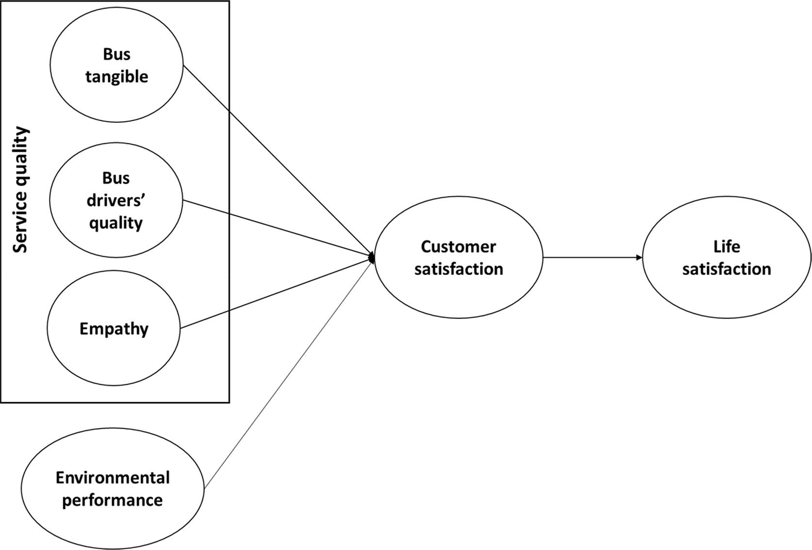
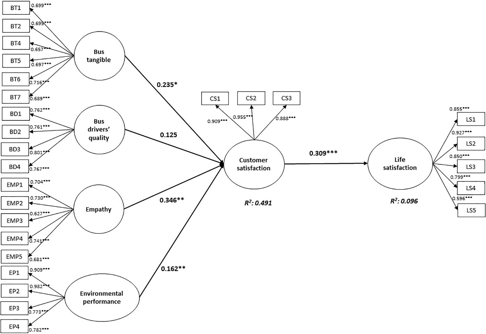

# 结构方程模型：Python与R语言实现与对比
## 简介

结构方程模型（SEM）是一种复合统计分析方法，它允许同时对多个回归方程进行估计和检验。这种方法特别适用于探索变量之间的因果关系，尤其是当这些关系包含潜在变量时。SEM结合了因子分析和多变量回归分析的特点，使得研究者能够考察观测变量与潜在变量之间的关系，以及潜在变量之间的相互作用。

### 应用领域：
1. 社会科学：在心理学、社会学、教育学等领域，SEM被广泛用来研究人类行为和社会现象。例如，探究家庭背景、学习态度和学术成就之间的关系。

2. 市场研究：企业和市场研究员使用SEM来评估品牌形象、顾客满意度和品牌忠诚度之间的关系，以及这些因素如何影响消费者的购买意向。

3. 生物统计与医学研究：在生物统计学中，SEM用于分析基因表达数据、疾病风险因素和患病机率之间的复杂关系。

4. 环境科学：研究环境行为对人类健康影响的模型，例如，评估空气污染水平对公共健康的潜在影响。

5. 经济学与金融学：SEM用于分析经济政策、市场结构和金融风险管理等问题，探究宏观经济变量间的相互作用。

通过使用SEM，研究者能够构建更为精细和复杂的模型来分析数据，这些模型可以更准确地反映现实世界中的变量间关系。SEM的一个关键优点是能够处理不可观测的潜在变量，这些潜在变量往往在许多研究领域中扮演着重要角色。此外，SEM提供了一种评估模型整体拟合度的方法，允许研究者判断整个模型与观测数据的一致性程度

## 结构方程模型概述
结构方程模型（SEM）在统计分析中的重要性体现在多个方面，使其成为社会科学、经济学、心理学等领域研究中不可或缺的工具。以下是SEM在统计分析中重要性的详细介绍：

1. 多变量关系分析
SEM能够同时处理多个依赖变量之间的复杂关系，这是传统统计方法（如线性回归）难以做到的。通过构建和估计多个回归方程，SEM可以揭示变量间的直接和间接效应，为研究者提供更全面的数据分析视角。

2. 潜在变量的建模
SEM的一个核心特点是能够包含潜在变量，即那些无法直接观测或测量的变量。潜在变量的引入有助于解释观测变量之间的关系，使得模型更贴近理论构想。例如，在心理学研究中，潜在变量如“智力”或“满意度”经常通过多个指标来衡量。

3. 假设驱动的研究
SEM是一种假设驱动的方法，它要求研究者基于理论或先前研究构建模型。这种方法论要求研究者明确地表述预期的因果关系，从而有助于科学研究的严谨性和理论的发展。

4. 模型拟合度评估
SEM提供了一系列统计指标来评估模型与实际数据的拟合程度，包括比如卡方统计量、比较拟合指数（CFI）、根均方误差近似（RMSEA）等。这些指标帮助研究者评估模型的有效性，判断模型是否需要调整。

5. 复杂数据结构的分析
SEM支持复杂数据结构的分析，包括跨时点的纵向数据、多层次数据等。这使得SEM在多学科领域的应用更为广泛，能够适应不同类型数据分析的需求。

6. 方法论创新与发展
随着计算能力的提升和统计方法的发展，SEM不断引入新的估计方法和模型扩展，如使用贝叶斯方法估计参数、结合机器学习技术等。这些创新不仅扩展了SEM的应用范围，也推动了统计学和其他学科方法论的进步。

结合以上特点，SEM在统计分析中的重要性不仅体现在其强大的数据分析能力上，还在于其推动研究方法论发展和跨学科研究的能力。通过精确地建模和分析变量间的复杂关系，SEM帮助研究者深入理解现象背后的因果机制，为科学研究提供有力的统计支持。

## Python和R比较的必要性
在结构方程模型（SEM）的研究和实现方面比较Python和R是非常有必要的，原因如下：

1. 两大主流统计编程语言：
Python和R是当前数据分析、统计建模和机器学习领域两大主流编程语言。它们各自拥有独特的优势和特点，适用于不同的数据分析任务。比较这两种语言在结构方程模型实现方面的能力，可以帮助用户根据自己的需求、项目背景和个人偏好选择最适合的工具。

2. 功能和库的差异：
尽管Python和R都提供了实现SEM的功能，但它们各自支持的库和包在功能上存在差异。例如，Python的semopy和R的lavaan都是专门用于SEM分析的库，但在语法设计、用户界面和一些高级功能上可能有所不同。通过比较，研究人员可以更好地了解每种工具的优势和局限。

3. 社区和资源支持：
Python和R各自拥有庞大的用户社区和丰富的学习资源。社区的活跃程度、可用的教程、案例研究和技术支持在选择工具时也是重要的考虑因素。通过比较，可以发现哪种语言为SEM分析提供了更好的学习和实践资源。

4. 性能和效率：
对于大规模数据集或复杂模型的SEM分析，Python和R在处理速度、内存管理和并行计算支持等方面的性能差异可能会影响分析效率和结果。通过比较，研究人员可以选择在特定条件下性能更优的工具。

5. 灵活性和可扩展性：
Python以其广泛的应用和强大的通用编程能力而闻名，而R则专注于统计分析和图形展示。对于跨学科的复杂项目，需要同时进行数据处理、统计分析和机器学习等任务时，比较这两种语言的灵活性和可扩展性变得尤为重要。

总之，比较Python和R在结构方程模型方面的实现能力，不仅有助于研究人员和数据分析师选择最适合的工具，也促进了两种语言及其社区的发展，鼓励开发者改进和增强现有的统计分析功能。

## 案例研究
年轻人对混合混合动力公交车（HEB）环境绩效的服务质量感知

H1:Tangible feature of HEBs is positively associated with young people’s customer satisfaction.
混合动力公交车的有形特征与年轻人的客户满意度呈正相关。

H2:HEB driver’s quality is positively associated with young people’s customer satisfaction.
混合动力公交车司机的服务质量与年轻人的客户满意度呈正相关。

H3:HEB service provider’s empathy is positively associated with young people’s customer satisfaction.
混合动力公交车司机的同理心与年轻人的客户满意度呈正相关。

H4:Young people’s perceived environmental performance with HEBs is positively associated with customer satisfaction.
混合动力公交车的环境绩效感知年轻人客户满意度呈正相关。

H5:Young people’s customer satisfaction with HEBs is positively associated with life satisfaction of young people.
混合动力公交车的客户满意度与年轻人的生活满意度呈正相关。

间接/中介效应

巴士有形 -> 顾客满意 -> 生活满意

司机服务 -> 顾客满意 -> 生活满意

司机同理心 -> 顾客满意 -> 生活满意

环境绩效 -> 顾客满意 -> 生活满意



## Python实现SEM
基础环境

语言: python3

IDE: Jupyter Notebook、Anaconda、pycharm

库: semopy

```Python
# Install and load the necessary package
import pandas as pd
from semopy import Model
from semopy.stats import calc_stats

# Load your data
data = pd.read_excel("../data/cleandata.xlsx")

# Specify SEM model
model_spec = """
# 测量模型
BusTangible =~ BT1 + BT2 + BT4 + BT5 + BT6 + BT7
BusDriversQuality =~ BD1 + BD2 + BD3 + BD4
Empathy =~ EMP1 + EMP2 + EMP3 + EMP4 + EMP5
EnvironmentalPerformance =~ EP1 + EP2 + EP3 + EP4
CustomerSatisfaction =~ CS1 + CS2 + CS3
LifeSatisfaction =~ LS1 + LS2 + LS3 + LS4 + LS5

# 结构模型
CustomerSatisfaction ~ BusTangible + BusDriversQuality + Empathy + EnvironmentalPerformance
LifeSatisfaction ~ CustomerSatisfaction
"""

# Fit the SEM model
# 实例化并拟合模型
sem_model = Model(model_spec)
res = sem_model.fit(data)
estimates = mod.inspect()

# Get a summary of the fit
print(res)

# Get standardized estimates of the model
print(estimates)
```
### Python输出
下面是Python输出展示了结构方程模型（SEM）的分析结果，其中包括自变量（rval列）、因变量（lval列）、以及它们之间关系的估计系数（Estimate）、标准误差（Std. Err）、z值（z-value）和p值（p-value）。

z值（z-value）和p值（p-value）都用于评估结果的统计显著性，但它们表示的内容有所不同。z值是一个标准分数，表示观察到的结果与零假设预期结果之间的距离，以标准差为单位。它可以告诉我们观察结果偏离平均值的程度。而p值是在零假设成立的前提下，观察到当前结果或更极端结果的概率。p值越小，表明数据与零假设不一致的证据越强，常用来判断结果是否具有统计显著性。

例如，CustomerSatisfaction ~ BusTangible表示客户满意度（因变量）与巴士有形特征（自变量）之间的关系。估计系数（Estimate）显示这种关系的大小和方向，而p值告诉我们这种关系在统计上是否显著。

```Python output
                        lval  op                      rval  Estimate  Std. Err    z-value   p-value
0       CustomerSatisfaction   ~               BusTangible  0.312992  0.113946   2.746852  0.006017
1       CustomerSatisfaction   ~         BusDriversQuality  0.132131  0.096675   1.366748  0.171704
2       CustomerSatisfaction   ~                   Empathy  0.366919  0.080496    4.55821  0.000005
3       CustomerSatisfaction   ~  EnvironmentalPerformance  0.155423  0.057013   2.726103  0.006409
4           LifeSatisfaction   ~      CustomerSatisfaction  0.270154  0.055035    4.90875  0.000001
5                        BT1   ~               BusTangible  1.000000         -          -         -
6                        BT2   ~               BusTangible  1.020659  0.099084  10.300981       0.0
7                        BT4   ~               BusTangible  0.986033  0.100776   9.784428       0.0
8                        BT5   ~               BusTangible  1.078787  0.104512   10.32217       0.0
9                        BT6   ~               BusTangible  1.124020   0.10626  10.577979       0.0
10                       BT7   ~               BusTangible  1.131608   0.11066  10.226018       0.0
11                       BD1   ~         BusDriversQuality  1.000000         -          -         -
12                       BD2   ~         BusDriversQuality  0.942073   0.07612  12.376091       0.0
13                       BD3   ~         BusDriversQuality  1.038297   0.07969  13.029137       0.0
14                       BD4   ~         BusDriversQuality  0.897086  0.071929  12.471812       0.0
15                      EMP1   ~                   Empathy  1.000000         -          -         -
16                      EMP2   ~                   Empathy  0.922588  0.087175  10.583131       0.0
17                      EMP3   ~                   Empathy  0.923554  0.099992   9.236241       0.0
18                      EMP4   ~                   Empathy  0.869668  0.081195  10.710816       0.0
19                      EMP5   ~                   Empathy  0.877715  0.088116   9.960953       0.0
20                       EP1   ~  EnvironmentalPerformance  1.000000         -          -         -
21                       EP2   ~  EnvironmentalPerformance  1.065332   0.03602  29.576499       0.0
22                       EP3   ~  EnvironmentalPerformance  0.850671  0.049282  17.261336       0.0
23                       EP4   ~  EnvironmentalPerformance  0.892862  0.050627  17.636028       0.0
24                       CS1   ~      CustomerSatisfaction  1.000000         -          -         -
25                       CS2   ~      CustomerSatisfaction  1.022558  0.037659  27.153395       0.0
26                       CS3   ~      CustomerSatisfaction  1.044535  0.045584  22.914535       0.0
27                       LS1   ~          LifeSatisfaction  1.000000         -          -         -
28                       LS2   ~          LifeSatisfaction  1.092190  0.052638  20.749127       0.0
29                       LS3   ~          LifeSatisfaction  1.049600  0.058365  17.983358       0.0
30                       LS4   ~          LifeSatisfaction  1.102057  0.067851    16.2423       0.0
31                       LS5   ~          LifeSatisfaction  0.874116   0.08153   10.72137       0.0
32         BusDriversQuality  ~~         BusDriversQuality  1.310814  0.185842    7.05338       0.0
33               BusTangible  ~~               BusTangible  0.832660   0.13352   6.236218       0.0
34               BusTangible  ~~         BusDriversQuality  0.720818  0.103662   6.953533       0.0
35               BusTangible  ~~                   Empathy  0.491679  0.091876   5.351575       0.0
36               BusTangible  ~~  EnvironmentalPerformance  0.594983    0.0941   6.322881       0.0
37      CustomerSatisfaction  ~~      CustomerSatisfaction  0.748602  0.084602   8.848521       0.0
38                   Empathy  ~~                   Empathy  1.308675  0.210841   6.206922       0.0
39                   Empathy  ~~         BusDriversQuality  0.797529   0.12341   6.462423       0.0
40                   Empathy  ~~  EnvironmentalPerformance  0.594403  0.111372   5.337098       0.0
41  EnvironmentalPerformance  ~~  EnvironmentalPerformance  1.587523  0.164403   9.656276       0.0
42  EnvironmentalPerformance  ~~         BusDriversQuality  0.640345  0.109803    5.83176       0.0
43          LifeSatisfaction  ~~          LifeSatisfaction  1.012728  0.117966   8.584884       0.0
44                       BD1  ~~                       BD1  0.945177  0.101253   9.334827       0.0
45                       BD2  ~~                       BD2  0.842516  0.090155   9.345182       0.0
46                       BD3  ~~                       BD3  0.791508  0.091452   8.654892       0.0
47                       BD4  ~~                       BD4  0.737480   0.07964   9.260146       0.0
48                       BT1  ~~                       BT1  0.870267  0.087419   9.955125       0.0
49                       BT2  ~~                       BT2  0.928811  0.092915   9.996362       0.0
50                       BT4  ~~                       BT4  1.065371  0.103339  10.309517       0.0
51                       BT5  ~~                       BT5  1.028581  0.103048   9.981577       0.0
52                       BT6  ~~                       BT6  1.002423  0.102413   9.788078       0.0
53                       BT7  ~~                       BT7  1.177356  0.117181   10.04729       0.0
54                       CS1  ~~                       CS1  0.307410  0.037025   8.302719       0.0
55                       CS2  ~~                       CS2  0.147644  0.029271   5.044124       0.0
56                       CS3  ~~                       CS3  0.428007  0.046779    9.14955       0.0
57                      EMP1  ~~                      EMP1  1.332171  0.138825   9.596049       0.0
58                      EMP2  ~~                      EMP2  0.974811   0.10534   9.253923       0.0
59                      EMP3  ~~                      EMP3  1.720612  0.166951  10.306066       0.0
60                      EMP4  ~~                      EMP4  0.814061  0.089474   9.098286       0.0
61                      EMP5  ~~                      EMP5  1.162817  0.118146   9.842174       0.0
62                       EP1  ~~                       EP1  0.334936  0.038766   8.639947       0.0
63                       EP2  ~~                       EP2  0.065811  0.029199   2.253889  0.024203
64                       EP3  ~~                       EP3  0.772948  0.070143  11.019526       0.0
65                       EP4  ~~                       EP4  0.804288  0.073303  10.972042       0.0
66                       LS1  ~~                       LS1  0.411645  0.044789   9.190718       0.0
67                       LS2  ~~                       LS2  0.218802  0.034961    6.25841       0.0
68                       LS3  ~~                       LS3  0.475332  0.051035   9.313855       0.0
69                       LS4  ~~                       LS4  0.768538  0.076086  10.100901       0.0
70                       LS5  ~~                       LS5  1.551473  0.138635  11.191088       0.0
```


## R实现SEM
基础环境

语言: R

IDE: RStudio

库: lavaan

```R
# Install and load the necessary package
#install.packages("lavaan")
library(lavaan)

# Load your data
#install.packages("readxl")
library(readxl)

data <- read_excel("/Users/mac/Desktop/cleandata.xlsx")

# Specify SEM model
model_spec <- '
  # Measurement model for latent variables
  BusTangible =~ BT1 + BT2 + BT4 + BT5 + BT6 + BT7
  BusDriversQuality =~ BD1 + BD2 + BD3 + BD4
  Empathy =~ EMP1 + EMP2 + EMP3 + EMP4 + EMP5
  EnvironmentalPerformance =~ EP1 + EP2 + EP3 + EP4
  CustomerSatisfaction =~ CS1 + CS2 + CS3
  LifeSatisfaction =~ LS1 + LS2 + LS3 + LS4 + LS5
  
  # Structural model for path relationships
  CustomerSatisfaction ~ BusTangible + BusDriversQuality + Empathy + EnvironmentalPerformance
  LifeSatisfaction ~ CustomerSatisfaction
'

# Fit the SEM model
fit <- sem(model_spec, data = data)

# Get a summary of the fit
summary(fit)

# Get standardized estimates of the model
standardizedSolution(fit)
```

### R输出
这个R的输出结果显示了结构方程模型（SEM）分析的详细结果，包括模型中各变量间的关系。在这里，lhs代表左手边的变量（因变量），op表示操作符（=~表示测量模型中的指标变量，~表示结构模型中的回归关系，~~表示方差或协方差），rhs代表右手边的变量（自变量或潜在变量），est.std是标准化估计系数，se是标准误，z是z值，pvalue是p值，ci.lower和ci.upper分别是置信区间的下限和上限。

自变量：通常位于rhs列，指模型中作为预测因素的变量。

因变量：通常位于lhs列，指模型中被预测或解释的变量。

例如，BusTangible =~ BT1表示公交车有形特征（BusTangible）是BT1的潜在变量，而CustomerSatisfaction ~ BusTangible表示客户满意度（CustomerSatisfaction）被巴士有形特征（BusTangible）所预测。这些结果帮助研究者理解不同因素如何影响顾客满意度及其对生活满意度的进一步影响。

```R output
                        lhs op                      rhs est.std    se      z pvalue ci.lower ci.upper
1               BusTangible =~                      BT1   0.699 0.036  19.20  0.000    0.628    0.771
2               BusTangible =~                      BT2   0.695 0.037  18.91  0.000    0.623    0.767
3               BusTangible =~                      BT4   0.657 0.040  16.58  0.000    0.579    0.735
4               BusTangible =~                      BT5   0.697 0.037  19.02  0.000    0.625    0.768
5               BusTangible =~                      BT6   0.716 0.035  20.37  0.000    0.647    0.784
6               BusTangible =~                      BT7   0.689 0.037  18.54  0.000    0.617    0.762
7         BusDriversQuality =~                      BD1   0.762 0.031  24.66  0.000    0.702    0.823
8         BusDriversQuality =~                      BD2   0.761 0.031  24.57  0.000    0.701    0.822
9         BusDriversQuality =~                      BD3   0.801 0.028  28.77  0.000    0.746    0.855
10        BusDriversQuality =~                      BD4   0.767 0.031  25.12  0.000    0.707    0.827
11                  Empathy =~                     EMP1   0.704 0.037  18.91  0.000    0.631    0.777
12                  Empathy =~                     EMP2   0.730 0.035  20.72  0.000    0.661    0.799
13                  Empathy =~                     EMP3   0.627 0.043  14.64  0.000    0.543    0.711
14                  Empathy =~                     EMP4   0.741 0.034  21.50  0.000    0.673    0.808
15                  Empathy =~                     EMP5   0.681 0.039  17.52  0.000    0.605    0.758
16 EnvironmentalPerformance =~                      EP1   0.909 0.013  70.28  0.000    0.883    0.934
17 EnvironmentalPerformance =~                      EP2   0.982 0.008 121.30  0.000    0.966    0.998
18 EnvironmentalPerformance =~                      EP3   0.773 0.026  30.22  0.000    0.723    0.823
19 EnvironmentalPerformance =~                      EP4   0.782 0.025  31.55  0.000    0.733    0.830
20     CustomerSatisfaction =~                      CS1   0.909 0.013  68.80  0.000    0.883    0.935
21     CustomerSatisfaction =~                      CS2   0.955 0.010  97.72  0.000    0.936    0.974
22     CustomerSatisfaction =~                      CS3   0.888 0.015  58.87  0.000    0.859    0.918
23         LifeSatisfaction =~                      LS1   0.855 0.019  44.06  0.000    0.817    0.893
24         LifeSatisfaction =~                      LS2   0.927 0.013  69.56  0.000    0.901    0.953
25         LifeSatisfaction =~                      LS3   0.850 0.020  42.68  0.000    0.811    0.889
26         LifeSatisfaction =~                      LS4   0.799 0.025  32.52  0.000    0.751    0.848
27         LifeSatisfaction =~                      LS5   0.596 0.041  14.41  0.000    0.515    0.677
28     CustomerSatisfaction  ~              BusTangible   0.235 0.083   2.82  0.005    0.072    0.399
29     CustomerSatisfaction  ~        BusDriversQuality   0.125 0.091   1.38  0.169   -0.053    0.303
30     CustomerSatisfaction  ~                  Empathy   0.346 0.070   4.95  0.000    0.209    0.483
31     CustomerSatisfaction  ~ EnvironmentalPerformance   0.162 0.059   2.75  0.006    0.047    0.277
32         LifeSatisfaction  ~     CustomerSatisfaction   0.309 0.059   5.28  0.000    0.195    0.424
33                      BT1 ~~                      BT1   0.511 0.051  10.04  0.000    0.411    0.611
34                      BT2 ~~                      BT2   0.517 0.051  10.12  0.000    0.417    0.617
35                      BT4 ~~                      BT4   0.568 0.052  10.91  0.000    0.466    0.670
36                      BT5 ~~                      BT5   0.515 0.051  10.09  0.000    0.415    0.615
37                      BT6 ~~                      BT6   0.488 0.050   9.71  0.000    0.389    0.586
38                      BT7 ~~                      BT7   0.525 0.051  10.24  0.000    0.424    0.625
39                      BD1 ~~                      BD1   0.419 0.047   8.88  0.000    0.326    0.511
40                      BD2 ~~                      BD2   0.420 0.047   8.90  0.000    0.328    0.513
41                      BD3 ~~                      BD3   0.359 0.045   8.05  0.000    0.272    0.446
42                      BD4 ~~                      BD4   0.411 0.047   8.78  0.000    0.320    0.503
43                     EMP1 ~~                     EMP1   0.504 0.052   9.62  0.000    0.402    0.607
44                     EMP2 ~~                     EMP2   0.467 0.051   9.06  0.000    0.366    0.568
45                     EMP3 ~~                     EMP3   0.607 0.054  11.29  0.000    0.501    0.712
46                     EMP4 ~~                     EMP4   0.451 0.051   8.84  0.000    0.351    0.551
47                     EMP5 ~~                     EMP5   0.536 0.053  10.10  0.000    0.432    0.639
48                      EP1 ~~                      EP1   0.174 0.023   7.42  0.000    0.128    0.220
49                      EP2 ~~                      EP2   0.035 0.016   2.22  0.027    0.004    0.066
50                      EP3 ~~                      EP3   0.402 0.040  10.17  0.000    0.325    0.480
51                      EP4 ~~                      EP4   0.389 0.039  10.03  0.000    0.313    0.465
52                      CS1 ~~                      CS1   0.173 0.024   7.20  0.000    0.126    0.220
53                      CS2 ~~                      CS2   0.088 0.019   4.70  0.000    0.051    0.124
54                      CS3 ~~                      CS3   0.211 0.027   7.86  0.000    0.158    0.263
55                      LS1 ~~                      LS1   0.269 0.033   8.10  0.000    0.204    0.334
56                      LS2 ~~                      LS2   0.141 0.025   5.70  0.000    0.092    0.189
57                      LS3 ~~                      LS3   0.278 0.034   8.22  0.000    0.212    0.344
58                      LS4 ~~                      LS4   0.361 0.039   9.19  0.000    0.284    0.438
59                      LS5 ~~                      LS5   0.644 0.049  13.06  0.000    0.548    0.741
60              BusTangible ~~              BusTangible   1.000 0.000     NA     NA    1.000    1.000
61        BusDriversQuality ~~        BusDriversQuality   1.000 0.000     NA     NA    1.000    1.000
62                  Empathy ~~                  Empathy   1.000 0.000     NA     NA    1.000    1.000
63 EnvironmentalPerformance ~~ EnvironmentalPerformance   1.000 0.000     NA     NA    1.000    1.000
64     CustomerSatisfaction ~~     CustomerSatisfaction   0.509 0.049  10.39  0.000    0.413    0.605
65         LifeSatisfaction ~~         LifeSatisfaction   0.904 0.036  24.94  0.000    0.833    0.975
66              BusTangible ~~        BusDriversQuality   0.690 0.043  16.02  0.000    0.606    0.774
67              BusTangible ~~                  Empathy   0.471 0.059   7.96  0.000    0.355    0.587
68              BusTangible ~~ EnvironmentalPerformance   0.517 0.051  10.19  0.000    0.418    0.617
69        BusDriversQuality ~~                  Empathy   0.609 0.050  12.16  0.000    0.511    0.707
70        BusDriversQuality ~~ EnvironmentalPerformance   0.444 0.055   8.13  0.000    0.337    0.551
71                  Empathy ~~ EnvironmentalPerformance   0.412 0.057   7.19  0.000    0.300    0.525
```

### 案例研究结果
通过Python和R语言实现SEM模型，得到了如下结果：



### 案例研究结论
通过结果分析，我们得到了以下结论：

| 假设 | 标准化系数 | 评论 |
|------|------------|------|
| H1：巴士有形→客户满意度 | 0.24 (0.13) * | 支持 |
| H2：公交车司机素质→顾客满意度 | 0.13 (0.12) | 不支持 |
| H3：同理心→客户满意度 | 0.35 (0.11) ** | 支持 |
| H4：环境绩效→顾客满意度 | 0.16 (0.06) ** | 支持 |
| H5：顾客满意度→生活满意度 | 0.31 (0.06) *** | 支持 |

星号(*)表示显著性水平，*代表p<0.05，**代表p<0.01，***代表p<0.001。

## Python与R的对比
| 特性说明      | Python                                                              | R                                                                  |
|-----------|--------------------------------------------------------------------|--------------------------------------------------------------------|
| **环境搭建**  | Anaconda发行版提供一站式数据科学环境，安装配置较为复杂。                          | 用户需手动安装R环境和RStudio，安装过程相对简单。                             |
| **学习曲线**  | 库众多，内容广泛，学习曲线较陡峭。                                           | 语法灵活，统计库丰富，学习曲线较平缓。                                      |
| **数据处理**  | Pandas库提供丰富的数据处理功能，功能强大但增加复杂度。                             | dplyr和tidyr库提供类似功能，在非大规模数据处理时较为方便。                      |
| **输出结果**  | 数据输出灵活，需要调整多个函数参数，输出结果不如R直观。                             | 输出结果直观，可以直接输出。                                             |
| **可视化**   | Matplotlib和Seaborn库提供丰富的可视化功能，也可使用Plotly等库。                      | ggplot2库提供强大的可视化功能，语法简洁易上手。                               |
| **SEM实现** | semopy库提供了强大的SEM功能，语法灵活，但需要掌握较多内容。                        | lavaan库提供了强大的SEM功能，语法简洁易上手。                                |

## 结论
Python和R语言都是数据科学领域的主流编程语言，各自拥有独特的优势和特点。
在结构方程模型（SEM）的实现方面，Python的semopy和R的lavaan都提供了强大的功能和灵活的语法，可以满足用户对于SEM分析的需求。
但是对于初学者来说，Python的学习曲线较为陡峭，需要掌握的内容较多，而R语言的语法较为灵活，针对统计方面的库较为丰富，学习曲线较为平缓。
对于研究社会科学的学者来说，R语言可能是更好的选择，而对于数据科学领域的研究者来说，Python可能是更好的选择。
总之，比较Python和R在结构方程模型方面的实现能力，不仅有助于研究人员和数据分析师选择最适合的工具，也促进了两种语言及其社区的发展，鼓励开发者改进和增强现有的统计分析功能。


